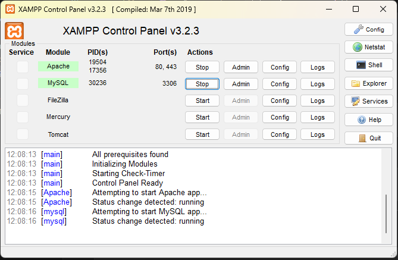

# ETE Acesso 2026

Sistema web para gerenciamento e controle de acesso da ETE (Escola Técnica Estadual) desenvolvido em PHP com banco de dados MySQL.

O projeto tem como objetivo fornecer uma estrutura simples para autenticação, controle de acesso e organização de um sistema institucional.

---

## 📁 Estrutura do Projeto

```
eteAcesso2026/
│
├── assets/              # Arquivos estáticos (CSS, JS, imagens)
├── configuracao/        # Arquivos de configuração do sistema
├── site/                # Páginas e módulos do sistema
│
├── acessoete26_bd.sql   # Script do banco de dados
├── index.php            # Arquivo principal de entrada da aplicação
└── README.md
```

---

## ⚙️ Tecnologias Utilizadas

- PHP
- MySQL / MariaDB
- HTML5
- CSS3
- JavaScript

---

## 🗄️ Banco de Dados

O banco de dados do projeto está disponível no arquivo:

```
C:\xampp\htdocs\eteAcesso2026\assets\banco de dados\ete_acesso26_bd.sql
```

### Para importar

1. Abra o **phpMyAdmin** ou outro gerenciador de banco de dados.
2. Crie um banco de dados chamado:

```
ete_acesso26_bd
```
```
utf8_general_ci
```

3. Importe o arquivo:

```
acessoete26_bd.sql
```

---

## 🚀 Como Executar o Projeto

### 0 Executar o Xampp:



### 1 Localizar o diretório do projeto:
```
xampp/htdocs/
```
### 2 Abrir terminal:
```
no mouse usar botão direito e ("Git Bash Here") 
```
### 3 Clonar o repositório
```bash
git clone https://github.com/dioramalho/eteAcesso2026.git
```

### 4 Acessar o diretório gerado 
```
xampp/htdocs/eteAcesso2026
```

### 5 Abrir com o vs-code 
```
xampp/htdocs/eteAcesso2026
```
---

### 6 Configurar o banco de dados

Ajuste os dados de conexão no arquivo dentro da pasta:

```
configuracao/conexao.php
```

Exemplo:

```php
$host = "localhost";
$user = "root";
$password = "";
$db = "eteAcesso2026";
```

### 7 Configurar projeto local

Ajuste os dados de conexão no arquivo dentro da pasta:

```
configuracao/configuracao.php
```

Exemplo:

```php
$enviroment['local'] = "http://localhost/eteAcesso2026/";
```

---

### 4️⃣ Acessar no navegador

```
http://localhost/eteAcesso2026/site/?pagina=acesso
```

---

## 📌 Objetivo do Projeto

Este projeto foi desenvolvido para:

- estudo de desenvolvimento web com PHP
- organização de sistemas institucionais
- prática de estruturação de projetos
- utilização em ambiente educacional da ETE

---

## 👨‍💻 Autor

**Diogo Ramalho**

GitHub:  
https://github.com/dioramalho

---

## 📄 Licença

Projeto desenvolvido para fins educacionais.
